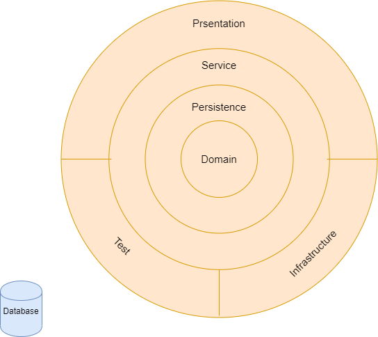

[](https://marketplace.visualstudio.com/items?itemName=AmitNaik.OnionArchitecture)
[](https://marketplace.visualstudio.com/items?itemName=AmitNaik.OnionArchitecture)
[](https://marketplace.visualstudio.com/items?itemName=AmitNaik.OnionArchitecture)
[](https://marketplace.visualstudio.com/items?itemName=AmitNaik.OnionArchitecture)

# WhiteApp/QuickApp Onion architecture with ASP.NET Core

<br />
<p align="center">
  <a href="#">
    
  </a>

  <h3 align="center">Onion Architecture</h3>

  <p align="center">
    WhiteApp or QuickApp API solution template which is built on Onion Architecture with all essential feature using .NET Core!
    <br />
    <a href="https://amitpnk.github.io/Onion-architecture-ASP.NET-Core/"><strong>Explore the docs »</strong></a>
    <br />
    <br />
    <a href="https://marketplace.visualstudio.com/items?itemName=AmitNaik.OnionArchitecture">Download from Marketplace</a>
    ·
    <a href="https://github.com/Amitpnk/Onion-architecture-ASP.NET-Core/issues">Report Bug</a>
    ·
    <a href="https://github.com/Amitpnk/Onion-architecture-ASP.NET-Core/issues/new">Request Feature</a>
  </p>
</p>

## Give a Star! :star:
If you like or are using this project to learn or start your solution, please give it a star. Thanks!

<!-- TABLE OF CONTENTS -->
## Table of Contents

* [Onion Architecture](#Onion-Architecture)
  * [reference](#reference)
* [About the Project](#about-the-project)
  <!-- * [Built With](#built-with) -->
* [Getting Started](#getting-started)
* [Features available in this project](#Features-available-in-this-project)
* [Project description](#project-description)
* [Design patterns Used](#roadmap)
* [Contributing](#contributing)
* [Licence Used](#Licence-Used)
* [Contact](#contact)
* [Support This Project](#Support-This-Project)
<!-- * [Acknowledgements](#acknowledgements) -->

## Onion Architecture

Onion Architecture was introduced by Jeffrey Palermo to provide a better way to build applications in perspective of better testability, maintainability, and dependability on the infrastructures like databases and services

Onion, Clean or Hexagonal architecture: it's all the same. Which is built on Domain-Driven Desgin approach.

Domain in center and building layer top of it. You can call it as Domain-centric Architecture too.

### Reference

* [It's all the same (Domain centeric architecture) - Mark Seemann](https://blog.ploeh.dk/2013/12/03/layers-onions-ports-adapters-its-all-the-same/)
* [Onion Architecture by Jeffrey Palermo](https://jeffreypalermo.com/2008/07/the-onion-architecture-part-1/)
* [Clean Architecture by Robert C. Martin (Uncle Bob)
](https://blog.cleancoder.com/uncle-bob/2012/08/13/the-clean-architecture.html)
* [Hexagonal Architecture by Dr. Alistair Cockburn](https://alistair.cockburn.us/hexagonal+architecture)

## About The Project

<!-- [![Product Name Screen Shot][product-screenshot]](https://example.com) -->

WhiteApp or QuickApp API solution template which is built on Onion Architecture with all essential feature using .NET Core.




## Getting Started

### Step 1: Download extension from project template

   <p> <a href="https://marketplace.visualstudio.com/items?itemName=AmitNaik.OnionArchitecture">Download from Marketplace</a></p>


### Step 2: Create Project

Select project type as API, and select Onion Architecture


### Step 3: Select Onion Architecture project template

Select project type as API, and select Onion Architecture


### Step 4: Project is ready


### Step 5: Configure connection string in appsettings.json

```json
 "ConnectionStrings": {
    "OnionArchConn": "Data Source=(local)\\SQLexpress;Initial Catalog=OnionDb;Integrated Security=True"
  },
```

### Step 6: Create Database (Sample is for Microsoft SQL Server)


For Code First approach (To run this application, use Code First apporach)

```sh
Update-Database
```

For Database First approach

In Package Manager console in *<< ProjectName >>.Persistence*, run below command

```sh
scaffold-dbcontext -provider Microsoft.EntityFrameworkCore.SqlServer -connection "Data Source=(local)\SQLexpress;Initial Catalog=OnionArchitectureDBS;Integrated Security=True"
```

### Step 7: Build and run application

Swagger UI


## Features available in this project

This is default white application for ASP.NET Core API development

This whiteapp contains following features, uncheck feature need to implement yet. 

- [x] Application is implemented on Onion architecture
- [x] API
- [x] Entityframework Core
- [x] Expection handling
- [x] Automapper
- [x] Unit testing via NUnit
- [x] Integration testing via NUnit
- [x] Versioning
- [x] Swagger
- [x] CQRS Pattern 

Below features will be implemented in infrastructure layer. You can plug and play based on your project.

- [x] Loggings - seriLog
- [x] Email
- [ ] Health checks
- [ ] JWT authentication
- [ ] React-redux for UI
- [ ] Fluent validations
- [ ] Hangfire
- [ ] Advanced Pagination

## Project description

we can see that all the Layers are dependent only on the Core Layers

<details>
  <summary><b>Domain layer</b></summary>
  <p>
    Domain Layers (Core layer) is implemented in center and never depends on any other layer. Therefore, what we do is that we create interfaces to Persistence layer and these interfaces get implemented in the external layers. This is also known and DIP or Dependency Inversion Principle
  </p>
</details>
<details>
  <summary><b>Persistence layer</b></summary>
  <p>
    In Persistence layer where we implement reposistory design pattern. In our project, we have implement Entityframework which already implements a repository design pattern. DbContext will be UoW (Unit of Work) and each DbSet is the repository. This interacts with our database using dataproviders
  </p>
</details>
<details>
  <summary><b>Service layer</b></summary>
  <p>
    Service layer (or also called as Application layer) where we can implement business logic. For OLAP/OLTP process, we can implement CQRS design pattern. In our project, we have implemented CQRS design pattern on top of Mediator design pattern via MediatR libraries
  </p>
  <p>In case you want to implement email feature logic, we define an IMailService in the Service Layer.
  Using DIP, it is easily possible to switch the implementations. This helps build scalable applications.
  </p>
</details>
<details>
  <summary><b>Infrastructure Layer</b></summary>
  <p>
    In this layer, we add our third party libraries like JWT Tokens Authentication or Serilog for logging, etc. so that all the third libraries will be in one place. In our project, we have implemented almost all important libraries, you can plug & play (add/remove) based on your project requirement in StartUp.cs file.
  </p>
</details>
<details>
  <summary><b>Presentation Layer</b></summary>
  <p>
    This can be WebApi or UI.

  </p>
</details>

## Licence Used
[![MIT License][license-shield]][license-url]

See the contents of the LICENSE file for details


## Contact

Having any issues or troubles getting started? Drop a mail to amit.naik8103@gmail.com or [Raise a Bug or Feature Request](https://github.com/Amitpnk/Onion-architecture-ASP.NET-Core/issues/new). Always happy to help.

## Support This Project

If you have found this project helpful, either as a library that you use or as a learning tool, please consider buying me a coffee:

<a href="https://www.buymeacoffee.com/amitpnaik" target="_blank"></a>

I do coding for fun during leisure time, but I have to pay the bills, so I also work for money :P  

[license-shield]: https://img.shields.io/badge/License-MIT-yellow.svg
[license-url]: https://github.com/Amitpnk/Onion-architecture-ASP.NET-Core/blob/master/LICENSE.txt